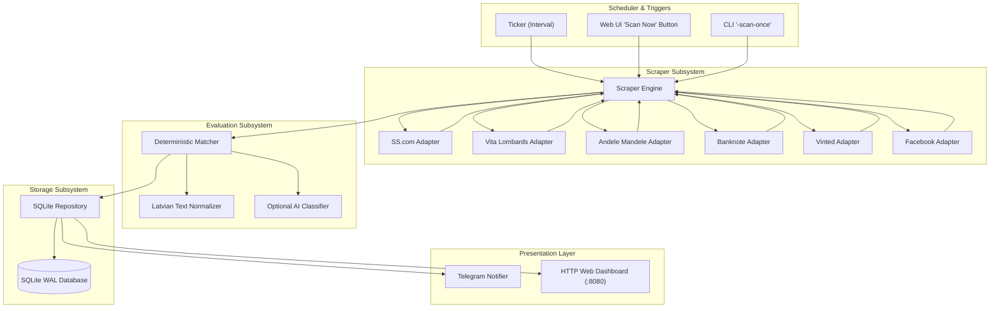

# Developer Documentation: Architecture & Internals 🧠

This document provides a technical deep-dive into how **ConnectClip Finder** is built, how data flows through the pipeline, and how developers can extend and maintain the codebase.

---

## 📑 Table of Contents
1. [High-Level Architecture](#1-high-level-architecture)
2. [End-to-End Scan Lifecycle](#2-end-to-end-scan-lifecycle)
3. [Scraper Subsystem (`internal/scraper/`)](#3-scraper-subsystem)
4. [Matching & Scoring Engine (`internal/matcher/`)](#4-matching--scoring-engine)
5. [Storage & Deduplication (`internal/storage/`)](#5-storage--deduplication)
6. [Notification Subsystem (`internal/notifier/`)](#6-notification-subsystem)
7. [Web Dashboard & REST API (`internal/web/`)](#7-web-dashboard--rest-api)
8. [Adding a New Marketplace Adapter](#8-adding-a-new-marketplace-adapter)

---

## 1. High-Level Architecture

The system is organized into modular packages under `internal/`:



---

## 2. End-to-End Scan Lifecycle

Each scan execution runs through the following sequence:

1. **Trigger:** Activated on a periodic ticker (`SCAN_INTERVAL`), via CLI (`-scan-once`), or via `POST /api/scan`.
2. **Mutual Exclusion:** The scheduler acquires a sync mutex (`sync.Mutex`). If a scan is already running, concurrent requests are safely blocked.
3. **Marketplace Fan-out:** The scraper engine iterates through enabled adapters. For each search query in `SEARCH_TERMS`, the adapter queries the marketplace.
4. **Fault Isolation:** If an individual source times out or triggers a bot challenge, it logs an informational warning and the scan continues uninterrupted for all other marketplaces.
5. **Deduplication Check:** Each discovered item is evaluated by `UpsertListing`:
   - If **new**: record is created in SQLite with `notified = 0`.
   - If **existing**: `last_seen_at` is updated. If the price changed, an entry is added to `price_history`.
6. **Matching & Scoring:** The deterministic matcher normalizes text, evaluates rules, assigns a score (0–100%), sets confidence level, and records human-readable match reasons.
7. **Telegram Alerting:** If `score >= MIN_ALERT_SCORE` and `notified == 0`:
   - An alert message is formatted with title, price, confidence, signals, and direct link.
   - If a photo URL exists, `sendPhoto` is dispatched; otherwise, falls back to `sendMessage`.
   - Listing is marked `notified = 1` in SQLite.
8. **Scan Audit Logging:** A run report is committed to `scan_runs` recording duration, items found, new listings, and source error statuses.

---

## 3. Scraper Subsystem (`internal/scraper/`)

### `SourceAdapter` Interface
Every marketplace adapter implements this clean interface:

```go
type SourceAdapter interface {
    Name() model.Source
    IsEnabled() bool
    Search(ctx context.Context, query string) ([]*model.Listing, error)
}
```

### Marketplace Implementation Details:

1. **SS.com (`sources/sscom.go`)**:
   - Sends HTTP GET requests to `https://www.ss.com/lv/search-result/?q=...`.
   - Parses the HTML table rows (`tr_...`) using `golang.org/x/net/html`.
   - Extracts item IDs (`tr_12345678`), prices in EUR via regex (`ssPriceRegex`), titles, category paths, and photo thumbnails.
   - Requires no authentication or cookies.

2. **Vita Lombards (`sources/vitalombards.go`)**:
   - Queries `https://vitalombards.lv/lv/?search=...`.
   - Parses embedded Google Analytics 4 JSON payloads (`data-ga4-item`) inside HTML product cards.
   - Provides clean numeric IDs, exact EUR prices, and high-resolution item photos.

3. **Andele Mandele (`sources/andele.go`)**:
   - Queries `https://www.andelemandele.lv/search/?search=...`.
   - Parses product card HTML articles, user locations, and price badges.

4. **Banknote (`sources/banknote.go`)**:
   - Queries store search `https://veikals.banknote.lv/lv/filter?q=...`.
   - Handles redirects and optional browser cookie headers (`BANKNOTE_COOKIES`).

5. **Vinted (`sources/vinted.go`)**:
   - Queries the Vinted catalog REST API `https://www.vinted.lv/api/v2/catalog/items?search_text=...`.
   - Bypasses Cloudflare Managed Challenges when provided with an exported browser session cookie (`VINTED_SESSION_COOKIE`).

6. **Facebook Marketplace (`sources/facebook.go`)**:
   - Queries `https://www.facebook.com/marketplace/riga/search/?query=...`.
   - Utilizes `FB_COOKIES` session headers to retrieve listings inside the Riga geofence.

---

## 4. Matching & Scoring Engine (`internal/matcher/`)

### Latvian Diacritic Normalization (`NormalizeText`)
Latvian second-hand titles frequently mix Latvian diacritics (`ā`, `č`, `ē`, `ģ`, `ī`, `ķ`, `ļ`, `ņ`, `š`, `ū`, `ž`) with ASCII equivalents (`a`, `c`, `e`, etc.). 

[`NormalizeText`](file:///c:/Users/rihar/GolandProjects/connectclip-finder/internal/matcher/rules.go) uses `strings.NewReplacer` to:
1. Lowercase all characters.
2. Strip Latvian diacritical marks.
3. Replace punctuation (`-`, `_`, `/`, `!`, `,`, `.`) with whitespace.
4. Collapse consecutive whitespace into single spaces.

### Rule Evaluation Pipeline
Rules implement the `Rule` struct:
```go
type Rule struct {
    Name   string
    Weight int // Positive bonus or negative penalty
    Check  func(title, desc string, price float64) (bool, string)
}
```

- **Additive Scoring:** Rules are evaluated independently; matching weights are summed.
- **Score Clamping:** The total score is clamped between 0% and 100%.
- **Confidence Mapping:**
  - $\ge 75\%$: `HIGH` (candidate for immediate notification)
  - $50 - 74\%$: `MEDIUM`
  - $25 - 49\%$: `LOW`
  - $< 25\%$: `NONE`

### Dynamic Custom Rules (`BuildCustomRules`)
When a user configures custom keywords in `.env` (`MATCH_EXACT_KEYWORDS`, `MATCH_MODEL_NUMBERS`, `MATCH_CONTEXT_KEYWORDS`, `MATCH_EXCLUDE_KEYWORDS`), the matcher dynamically constructs rules for that specific item rather than using hardcoded values.

---

## 5. Storage & Deduplication (`internal/storage/`)

### SQLite Architecture
- **Pure Go Driver:** Built using `modernc.org/sqlite` — requires no C compiler (CGO-free) and compiles cleanly across Windows, Linux, and macOS.
- **WAL Mode:** Write-Ahead Logging (`PRAGMA journal_mode=WAL`) is enabled on startup, allowing concurrent readers (web dashboard) without blocking scraper writers.
- **Busy Timeout:** Configured with `PRAGMA busy_timeout=5000` to prevent database locks.

### Database Schema:
```sql
CREATE TABLE listings (
    id TEXT PRIMARY KEY,
    source TEXT NOT NULL,
    source_id TEXT NOT NULL,
    url TEXT NOT NULL,
    title TEXT NOT NULL,
    description TEXT,
    price REAL,
    currency TEXT,
    image_urls TEXT,
    location TEXT,
    seller TEXT,
    score INTEGER NOT NULL,
    confidence TEXT NOT NULL,
    match_reasons TEXT,
    first_seen_at TIMESTAMP NOT NULL,
    last_seen_at TIMESTAMP NOT NULL,
    notified BOOLEAN NOT NULL DEFAULT 0,
    notified_at TIMESTAMP
);

CREATE TABLE price_history (
    id INTEGER PRIMARY KEY AUTOINCREMENT,
    listing_id TEXT NOT NULL,
    old_price REAL,
    new_price REAL,
    recorded_at TIMESTAMP NOT NULL
);

CREATE TABLE scan_runs (
    id INTEGER PRIMARY KEY AUTOINCREMENT,
    started_at TIMESTAMP NOT NULL,
    completed_at TIMESTAMP NOT NULL,
    duration_ms INTEGER NOT NULL,
    total_sources INTEGER NOT NULL,
    listings_discovered INTEGER NOT NULL,
    new_listings INTEGER NOT NULL,
    candidates_found INTEGER NOT NULL,
    notifications_sent INTEGER NOT NULL,
    source_errors TEXT
);
```

### Server-Side Pagination (`GetListingsPaged`)
To prevent multi-megabyte HTML payloads when thousands of items are stored, `GetListingsPaged` executes:
1. A parameterized `SELECT COUNT(*)` query matching active filters.
2. A parameterized `SELECT ... LIMIT ? OFFSET ?` query with whitelisted sort columns.
3. Reduces initial HTML payloads from **2.2+ MB down to ~138 KB** (>94% reduction).

---

## 6. Notification Subsystem (`internal/notifier/`)

- **HTML Caption Formatting:** Formats product titles, prices, source marketplace badges, confidence scores, and top match signals.
- **Dual Delivery Strategy:**
  1. If an image is available: invokes `sendPhoto` with photo URL and HTML caption.
  2. If photo dispatch fails or image is missing: falls back to `sendMessage` with plain HTML text.
- **Deduplication Guarantee:** The SQLite repository updates `notified = 1` atomically, preventing duplicate alerts across subsequent scans.

---

## 7. Web Dashboard & REST API (`internal/web/`)

### Architecture
- **Embedded & Zero-Dependency:** The HTML, CSS, and client-side JavaScript are embedded directly in Go strings — no external npm packages, CDNs, or file assets required.
- **Bilingual i18n:** Features full English (`en`) and Latvian (`lv`) translations with instant dynamic swapping and `localStorage` persistence.
- **Hybrid View Modes:**
  - **Pagination Mode:** Server-side windowed pagination buttons (`«`, `‹`, `1, 2, 3 ...`, `›`, `»`) with configurable page sizes (25, 50, 100, 200).
  - **Infinite Scroll Mode:** Background chunk fetching via `IntersectionObserver` sentinel and scroll listeners with spinner and manual fallback button.

### REST API Endpoints:

| Endpoint | Method | Parameters | Description |
| :--- | :--- | :--- | :--- |
| `/` | `GET` | `page`, `per_page`, `q`, `source`, `min_price`, etc. | Serves the HTML dashboard page. |
| `/api/listings` | `GET` | `paged=true`, `page`, `limit`, `sort`, `dir`, `q`, etc. | Returns JSON array or paginated object (`items`, `total`, `page`, `total_pages`). |
| `/api/scan` | `POST` | *(none)* | Triggers an immediate marketplace scan cycle in the background. |

---

## 8. Adding a New Marketplace Adapter

Adding support for a new second-hand marketplace (e.g. `dalder.lv`, `pp.lv`, `ebay.com`) takes only 5 steps:

### Step 1: Define the Source Constant (`internal/model/listing.go`)
```go
const (
    SourceNewMarketplace Source = "newmarket"
)
```

### Step 2: Implement the Adapter (`internal/scraper/sources/newmarket.go`)
Create a new file implementing the `SourceAdapter` interface:

```go
package sources

import (
    "context"
    "fmt"
    "net/http"
    "time"

    "connectclip-finder/internal/model"
)

type NewMarketAdapter struct {
    enabled bool
    client  *http.Client
}

func NewNewMarketAdapter(enabled bool) *NewMarketAdapter {
    return &NewMarketAdapter{
        enabled: enabled,
        client:  &http.Client{Timeout: 15 * time.Second},
    }
}

func (a *NewMarketAdapter) Name() model.Source {
    return model.SourceNewMarketplace
}

func (a *NewMarketAdapter) IsEnabled() bool {
    return a.enabled
}

func (a *NewMarketAdapter) Search(ctx context.Context, query string) ([]*model.Listing, error) {
    // 1. Send HTTP request
    // 2. Parse response (HTML or JSON)
    // 3. Return normalized []*model.Listing
    var listings []*model.Listing
    return listings, nil
}
```

### Step 3: Add Configuration Flag (`internal/config/config.go`)
```go
type Config struct {
    // ...
    NewMarketEnabled bool
}

// In Load():
NewMarketEnabled: getEnvBool("NEWMARKET_ENABLED", true),
```

### Step 4: Register in Main (`cmd/finder/main.go`)
```go
newMarketAdapter := sources.NewNewMarketAdapter(cfg.NewMarketEnabled)

engine := scraper.NewEngine(
    cfg.SearchTerms,
    ssAdapter,
    vitaAdapter,
    andeleAdapter,
    banknoteAdapter,
    vintedAdapter,
    fbAdapter,
    newMarketAdapter, // <-- Register here
)
```

### Step 5: Update `.env.example`
```env
NEWMARKET_ENABLED=true
```

That's it! The new marketplace will immediately participate in all scans, deduplication, matching, alerting, and web dashboard filtering.
